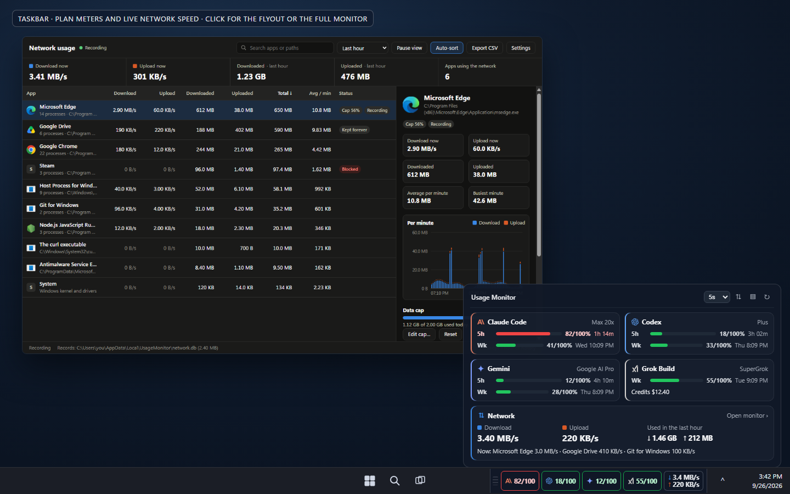
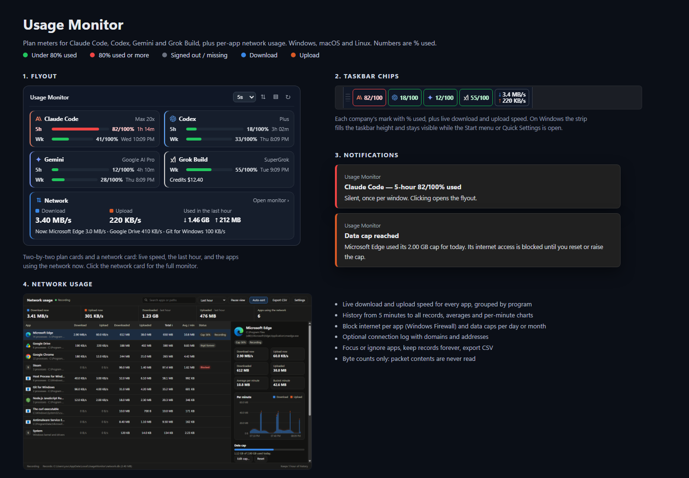
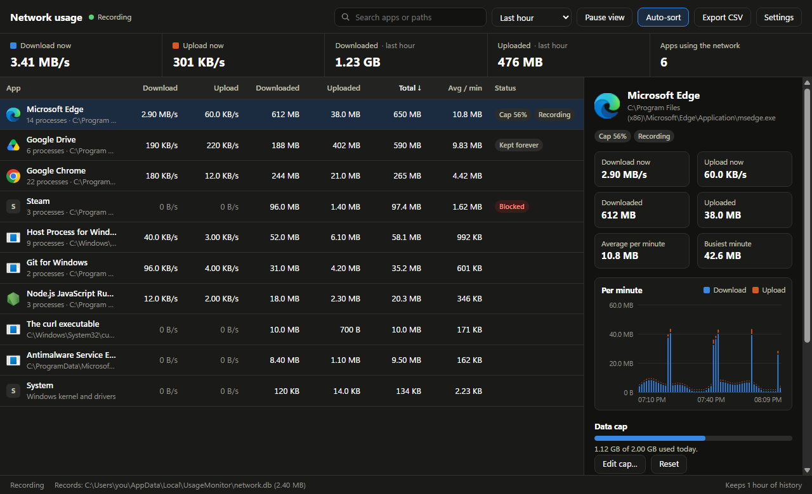

# Usage Monitor

A desktop app for **Windows, macOS and Linux** that shows two kinds of usage at a glance:

- **Plan meters:** how much of your **Claude Code**, **Codex**, **Gemini**, and **Grok Build** allowance you have used.
- **Network usage:** which apps are using your internet right now, and how much each used over time.

The meters reuse the logins those CLIs already stored on disk. No API keys. Nothing is sent except the same usage requests the official apps make. The network monitor records byte counts only, never the contents of your traffic.



## What you see

| Surface | What it does |
| --- | --- |
| **Flyout** | Two-by-two provider cards (5-hour / weekly, `used/total %`), plus a **Network** card with live download and upload speed, the data used in the last hour, and the apps using the network right now. Click the Network card (or the ⇅ button) to open the full Network usage window. It rests flush on top of the taskbar. **Open flyout** / **Hide flyout**. Click outside the panel to close it. On Windows, **Snap flyout to taskbar** / **Unsnap flyout from taskbar** parks the panel just above the taskbar. |
| **Chips** | Small strip with each company’s mark (Anthropic, OpenAI, Gemini, xAI) plus `82/100`, and a network chip with live speed (`↓ 1.2 MB/s ↑ 40 KB/s`; click it to open Network usage). On Windows, **Snap chips to taskbar** keeps them in an empty gap on the bar, as tall as the taskbar with 2px spare above and below (the network chip then shows download over upload), and stay visible while the Start menu or Quick Settings is open; if the bar has no room, the strip **pops out just above the taskbar**. On macOS and Linux the strip floats and can be dragged anywhere. If the overlay hits a paint/layout problem, the strip shows **loading…** instead of going blank, then the meters return. |
| **Network usage window** | Live download and upload speed for every app, history for the chosen time range, per-minute charts, data caps, blocking and connection logs. Open it from the tray menu (**Network usage…**) or start the app with `--network`. |
| **Tray icon** | A Usage Monitor icon in the notification area / menu bar; its tooltip shows the live network speed. **Click** it to show the chips again. **Right-click** for the menu (on Linux the menu opens on click). **Double-click** opens the flyout. |
| **Notifications** | A silent notification the first time a plan bar crosses 80% used, and when an app reaches its network data cap. |



| Mark | Provider | Windows shown |
| --- | --- | --- |
| Anthropic | Claude Code | 5-hour and weekly |
| OpenAI | Codex | 5-hour and weekly |
| Gemini | Gemini (Antigravity CLI / Gemini CLI) | Gemini model 5-hour and weekly when the API reports them |
| xAI | Grok Build | Weekly; monthly billing fallback when reported (no 5-hour bar) |

Grok's subscription percentage is shown as **weekly**; if the API only reports monthly billing usage and a monthly limit, that fallback is labeled **Monthly**. Gemini shows only Gemini model pools from Antigravity (`agy`) or Gemini CLI, retaining model labels when the period is unspecified.

## Network usage

See exactly which apps are using your internet, live and over time.



| Feature | Details |
| --- | --- |
| Live per-app usage | Download and upload speed for every app, updated every second. |
| History and averages | Keeps the last hour by default (older records are deleted automatically). Pick a range from 5 minutes to all records; each app shows its average per minute and a per-minute chart with its busiest minute. |
| Keep forever | Mark an app to keep its records indefinitely; they are never pruned. |
| Block internet per app | One click adds or removes a Windows Firewall rule for the app (Windows). |
| Data caps | Set a limit that counts until you reset it, per day, or per month. When an app reaches it you get a notification, and on Windows its internet access is blocked. Reset, raise or remove the cap to restore access. |
| Connection recording | Optionally record the domains and IP addresses an app talks to (off by default, per app, deletable, pruned with the rest of the history). |
| Pause the view | Freeze the list so you can read and click while recording continues. |
| Grouping | Every instance of a program (for example each `chrome.exe`, or every helper inside a macOS app bundle) is combined into one row with a process count. |
| Names and icons | Apps show their friendly name and real icon. |
| Search and sort | Filter by name or path and sort by any column. **Auto-sort** keeps re-sorting as the numbers change; turn it off to keep rows in place. |
| Focus and ignore | **Only track this app** records just the apps you choose; **Ignore this app** stops recording and hides it. Both lists are in Settings. |
| Records folder | Choose any folder for the records database (`network.db`). Existing records move with it, or you can switch to a database already in that folder. |
| Runs in the background | Closing the window keeps recording from the tray; **Start with Windows** / **Open at login** / **Start at login** starts it hidden. |
| Full control of data | Delete one app's records, records older than a chosen age, or everything. |
| Export | Save the current view (filtered and sorted) as CSV. |

### How it measures, per platform

| | Windows | macOS | Linux |
| --- | --- | --- | --- |
| Source | Kernel network events (Event Tracing for Windows), read by a small helper | `nettop` (built in) | Kernel socket statistics via `ss` (iproute2) |
| Admin rights | Once, to install the helper | No | No |
| Counts | TCP and UDP, including QUIC | TCP and UDP | TCP only |
| Domains | From DNS answers seen on the PC | Optional reverse DNS | Optional reverse DNS |
| Blocking | Windows Firewall rule per program | Not available | Not available |
| Data caps | Notify and block | Notify | Notify |

**Windows helper.** The first time you open **Network usage**, click **Set up (needs administrator)** and approve the prompt. Usage Monitor compiles its helper from source (`helpers/windows/NetCapture.cs`) with the C# compiler built into Windows, installs it under `C:\Program Files\Usage Monitor Network Helper\<your account>`, and registers a scheduled task (`\UsageMonitor\NetCapture-<your account>`) that runs it as SYSTEM at sign-in and whenever Usage Monitor starts. Only administrators can change those files. The helper only talks to your own Usage Monitor over a local named pipe, and it only adds or removes block rules it created (group **Usage Monitor** in Windows Firewall). When a new version of the helper ships, the window offers **Update helper**. To remove it, open **Settings → Network helper → Remove helper**; do this before uninstalling Usage Monitor.

**Honest limits.** None of this uses a packet driver, so full HTTPS URLs and packet contents can't be seen. They stay encrypted, and connection recording shows domains and IP addresses, not URLs. Speed throttling isn't included; use blocking or data caps to control heavy apps. Caps count while Usage Monitor is running. On Linux, UDP/QUIC traffic isn't countable without root, connections that open and close within a second can be missed, and apps owned by other users appear as **Other** unless Usage Monitor runs as root. macOS only allows per-app blocking through a signed network extension, so blocking isn't offered there.

## Requirements

- Windows 10/11, macOS 12 or newer, or a 64-bit Linux desktop with `ss` (iproute2; installed by default on most distributions)
- [Node.js](https://nodejs.org/) 22.13 or newer (source installs/builds only)
- For the plan meters, signed in to the tools you want metered:
  - [Claude Code](https://code.claude.com/) (`claude`)
  - [Codex](https://github.com/openai/codex) (`codex`)
  - [Antigravity CLI](https://antigravity.google/) (`agy`) or [Gemini CLI](https://github.com/google-gemini/gemini-cli) (`gemini`)
  - [Grok Build](https://grok.com/) (`grok`)

You do not need all four. A missing login shows as gray with a sign-in hint. On macOS, Claude Code keeps its login in the Keychain; Usage Monitor reads it there (macOS may ask once to allow access) and never rewrites it.

## Install

### Packaged app

Build outputs land in `dist/`:

| Platform | Command | Files |
| --- | --- | --- |
| Windows | `npm run dist` | `UsageMonitor-Setup-1.0.0.exe` (installer), `UsageMonitor-portable-1.0.0.exe` (single-file portable), `Usage Monitor-1.0.0-win.zip` (unpacked folder; best for **Start with Windows**) |
| macOS | `npm run dist:mac` (on a Mac) | `UsageMonitor-1.0.0-<arch>.dmg`, `.zip` |
| Linux | `npm run dist:linux` (on Linux) | `UsageMonitor-1.0.0-x86_64.AppImage`, `.tar.gz` |

```sh
npm install
npm run dist        # or dist:mac / dist:linux
```

Builds are unsigned. On macOS, open the app with right-click → **Open** the first time.

Sign in to the CLIs once (`claude`, `codex login`, `agy`, `grok`) so the meters can read usage. A packaged copy still uses those same local logins; it does not replace the CLIs.

### From source

```sh
git clone https://github.com/sb-git-cs/usage-monitor.git
cd usage-monitor
npm install
npm run setup
```

On Windows, `npm run setup` runs `scripts/install.ps1`, which:

1. Installs **Claude Code**, **Codex**, **Antigravity** (`agy`, Gemini), and **Grok Build** using each product’s official Windows installer
2. Skips any CLI already on your PATH
3. Starts Usage Monitor (`npm start`)

You can also double-click `scripts\install.cmd` or run `.\scripts\install.ps1` from the repo root. On macOS and Linux, `npm run setup` installs dependencies, lists where to get each CLI, and starts the app.

Sign in once per tool so the meters can read usage (a missing login shows as a gray chip):

```sh
claude
codex login
agy
grok
```

Usage Monitor only:

```sh
npm start
```

`npm start` **detaches** from the terminal: you can close the console and the app keeps running. Quit only from the right-click **Quit** menu. Use `npm run start:fg` if you want logs in the terminal (that process *will* die if you close the console).

The first launch:

- Shows the compact **chips** widget (snapped onto the Windows taskbar in an empty gap; floating on macOS and Linux)
- Registers **Start with Windows** / **Open at login** / **Start at login**. Uncheck it in the right-click menu to turn that off.
- Starts recording network usage (on Windows, once the helper is set up)

## Start at login

- **Windows:** a hidden **`Usage Monitor.vbs`** in the Startup folder runs Electron with no console. The network helper starts on its own through its scheduled task.
- **macOS:** a login item (packaged app only; a source checkout isn't registered).
- **Linux:** `~/.config/autostart/usage-monitor.desktop` (uses the AppImage path when packaged).

To disable, right-click the flyout, chips or tray icon and uncheck the login option.

With **Check for updates at startup** enabled (default), a launch also fetches `origin` from GitHub. If `main` is ahead of your copy, a Yes/No dialog appears before the meters keep running. **No** skips until the next start. The check needs Git on PATH and a clone of [sb-git-cs/usage-monitor](https://github.com/sb-git-cs/usage-monitor).

## Use

- **Left-click** chips → flyout. Click anywhere outside the flyout to close it (unless the flyout is snapped to the taskbar).
- **Tray icon** → show chips if they vanished. Right-click that icon for the menu. Double-click for the flyout.
- **Right-click** flyout, chips, or the tray icon → menu
  - **Network usage…** — open the network window
  - **Show chips** — bring the meters back if they went invisible
  - Hide / show chips
  - **Show network speed on chips** (on by default)
  - Refresh now
  - **Refresh every** — 5, 15, 30, or 60 seconds (default **5s**)
  - **Open flyout** / **Hide flyout**
  - **Start with Windows** / **Open at login** / **Start at login** (on by default after first launch)
  - **Check for updates at startup** (on by default). If a newer version is on GitHub, it asks **Yes / No**. Yes runs `git pull --ff-only` and `npm ci`, then restarts Usage Monitor.
  - **Check for updates now**
  - Windows only: **Snap flyout to taskbar** / **Unsnap flyout from taskbar**, **Snap chips to taskbar** / **Unsnap chips from taskbar**
  - Quit
- Drag flyout or chips **from the title bar / dotted grip** to move them anywhere. Positions are saved.
- Click a provider card to open that product’s official usage page (Claude, Codex, [Antigravity](https://antigravity.google), Grok)
- In **Network usage**: click an app for its chart, cap, block and record controls; right-click for the full menu; **Ctrl+F** / **Cmd+F** jumps to search; arrow keys move between apps.

Meters show **used/total %** (for example `82/100%`), not remaining. A full 5-hour window reads `100/100%` in red.

Chips show the current short window: 5-hour usage first, then daily usage when available. If neither is reported, they show another available quota such as weekly. Hover over a chip to see which window it shows. Warnings begin at 80%. Cached readings are marked stale (dashed chip borders); after a reported reset time passes, usage becomes unknown until the provider confirms the new reading. The app never assumes a reset means zero usage or invents the next reset date.

## Development checks

```sh
npm ci
npm test                      # unit tests, including network parsers, store, engine and helper protocol
npm run test:ui               # real Electron windows offscreen, including the network window
node scripts/probe-capture.js # macOS/Linux: live capture of a curl download
npm run screenshots           # regenerate docs/screenshots from the real UI with demo data
npm audit --audit-level=high
npm run dist
```

The screenshots in `docs/screenshots` are produced by `npm run screenshots`, which renders the real flyout, chips and network window offscreen with demo data (no real logins, usage or paths). The tests use synthetic credentials, responses and network samples. The UI smoke test uses hidden offscreen Electron windows and saves images under `.qa/`; it does not enable autostart or read your CLI logins. CI runs on Windows, macOS and Linux: unit and UI tests everywhere, the live capture probe on macOS and Linux, a compile and self-test of the Windows helper with Windows PowerShell 5.1, and an unpacked build per platform. See `review.md` for the defect list and `handoff.md` for release verification and remaining acceptance checks.

## Privacy

- Runs only on your computer; nothing about network usage leaves it
- The network monitor stores byte counts per app per minute, and domains/addresses only for apps where you turn on connection recording. It never reads packet contents
- Reverse DNS for recorded addresses is off by default; when on, lookups go to your DNS server
- Reads the credentials the CLIs already wrote (`~/.claude`, `.codex`, `.gemini`, `.grok`; on Windows also the Credential Manager entry `gemini:antigravity`; on macOS the Keychain item `Claude Code-credentials`)
- Polls each provider’s usage endpoint; never sends prompts, files, or chat history
- If **Check for updates at startup** is on, it runs `git fetch` against this GitHub repo (no extra personal data)
- Settings, logs and caches stay under `%APPDATA%\UsageMonitor` and `%LOCALAPPDATA%\UsageMonitor` (Windows), `~/Library/Application Support/UsageMonitor` (macOS), or `~/.config/UsageMonitor` and `~/.local/share/UsageMonitor` (Linux). Network records are in `network.db` there unless you choose another folder

## Troubleshooting

| Symptom | What to try |
| --- | --- |
| Gray company mark | Open that CLI once and sign in (`claude`, `codex login`, `agy`, `grok`). If the CLI is missing, run `npm run setup`. |
| No chips on the taskbar | Right-click flyout → **Show chips on taskbar**. They sit in an empty gap, not over the clock. |
| Chips jump or leave a gap on the taskbar | Right-click → **Snap chips to taskbar**, then drag the dotted grip to the gap you want. They stay there instead of re-snapping on every refresh. |
| Chips vanish while the app is still running | The strip should show **loading…** and recover on its own. If they still go missing, click the Usage Monitor tray icon, or right-click → **Show chips**. |
| Flyout missing | Right-click chips → **Open flyout**. Click outside the flyout to close it. |
| Claude stuck / stale | The usage API rate-limits aggressive polling. The app backs off and keeps the last good numbers |
| Network usage says **Setup needed** (Windows) | Click **Set up (needs administrator)** and approve the prompt. If you decline, nothing is installed. |
| **Helper not running** (Windows) | Click **Start helper**. If that fails, **Settings → Reinstall helper**. Details are in `helper.log` in the helper folder. |
| Block has no effect (Windows) | Windows Firewall must be on for the current network; the window warns when it is off. |
| An app is missing on Linux | UDP-only and very short-lived connections can't be counted without root; see **Settings → What this can and can't see**. |
| Does not start at login | Leave the login option checked; on Windows confirm `Usage Monitor.vbs` exists in the Startup folder. |
| Update check does nothing | Needs a `git clone` of this repo and `git` on PATH. Use **Check for updates now** to see the error. Local uncommitted changes can block `git pull`. |
| Extra Electron window / dies with the terminal | Use a packaged build or `npm start` (detached). Quit only from the right-click **Quit** menu. |
| Quit | Right-click chips or flyout → **Quit**. Hiding the flyout or closing the network window only hides them. |

## License

MIT
