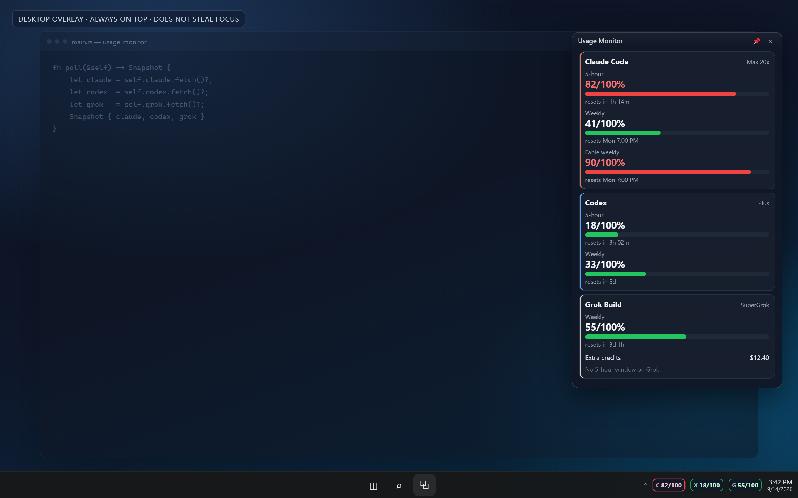

# Usage Monitor

A Windows tray app that shows how much of your **Claude Code**, **Codex**, and **Grok Build** allowance you have used — at a glance, while you work.

It reuses the logins those CLIs already stored on disk. No API keys. Nothing is sent except the same usage requests the official apps make.



## What you see

| Surface | What it does |
| --- | --- |
| **Desktop overlay** | Large glass HUD. Drag anywhere on screen; position is remembered. Pin to keep it up. Empty space clicks through. |
| **Flyout** | Compact meters panel (all 5-hour / weekly rows). Width fits `used/total %`. **Keep flyout open** pins it on the desktop. **Snap flyout to taskbar** parks the **full panel** just above the taskbar in an empty gap — not the chips bar. |
| **Chips** | Small `C 82/100` strip **on** the taskbar. **Snap chips to taskbar** is this strip only. |
| **Toast** | Silent red Windows notification the first time a bar crosses 80% used. |


Grok has a **weekly** pool only. The app does not invent a 5-hour Grok bar.


## Requirements

- Windows 10/11
- [Node.js](https://nodejs.org/) 20 or newer
- Signed in to the tools you want metered:
  - [Claude Code](https://code.claude.com/) (`claude`)
  - [Codex](https://github.com/openai/codex) (`codex`)
  - [Grok Build](https://grok.com/) (`grok`)

You do not need all three. A missing login shows as gray with a sign-in hint.

## Install

```powershell
git clone https://github.com/shivam-17/usage-monitor.git
cd usage-monitor
npm install
npm start
```

The first launch:

- Puts **Usage Monitor** on the Windows taskbar (click it to show the overlay)
- Snaps the compact **chips** widget onto the taskbar in an empty gap (always visible unless you hide it)
- Shows the **desktop overlay**
- Enables **Start with Windows** (uncheck from the right-click menu if you do not want that)

## Use

- **Left-click** chips → flyout
- **Right-click** overlay, flyout, or chips → menu
  - Open / hide overlay (hide minimizes to the taskbar; the app stays there)
  - Hide / show chips
  - Refresh now
  - **Refresh every** — 5, 15, 30, or 60 seconds (default **5s**)
  - Start with Windows
  - Pin overlay
  - **Keep flyout open** — stays up; drag it anywhere
  - **Snap flyout to taskbar** — full meters panel, just above the taskbar
  - **Snap chips to taskbar** — small `C / X / G` strip on the taskbar
  - Quit
- Drag overlay, flyout, or chips **from the title bar / dotted grip** to move them anywhere. Positions are saved.
- **Stick overlay here** / **Keep flyout open** / **Snap to taskbar** locks that surface. Snapped widgets stay on the taskbar in an empty gap until you uncheck snap. Uncheck snap first if you want to float them again.
- Glass panels: you can see through them; clicks on empty space pass through.
- Overlay **×** hides the HUD; it does not quit the app
- Click a provider card to open that product’s official usage page

Meters show **used/total %** (for example `82/100%`), not remaining. A full 5-hour window reads `100/100%` in red.

## Privacy

- Runs only on your PC
- Reads `%USERPROFILE%\.claude`, `.codex`, and `.grok` credentials the CLIs already wrote
- Polls each provider’s usage endpoint; never sends prompts, files, or chat history
- Logs and cache stay under `%APPDATA%\UsageMonitor` and `%LOCALAPPDATA%\UsageMonitor`

## Troubleshooting

| Symptom | What to try |
| --- | --- |
| Gray `C` / `X` / `G` | Open that CLI once and sign in (`claude`, `codex login`, `grok login`) |
| No chips on the taskbar | Right-click overlay → **Show chips on taskbar**. They sit in an empty gap, not over the clock. |
| Overlay missing | Click **Usage Monitor** on the Windows taskbar, or right-click chips → **Open overlay** |
| Claude stuck / stale | The usage API rate-limits aggressive polling. The app backs off for 15 minutes and keeps the last good numbers |
| Quit | Right-click chips or overlay → **Quit**. Closing/hiding the overlay only minimizes it. |

## License

MIT
