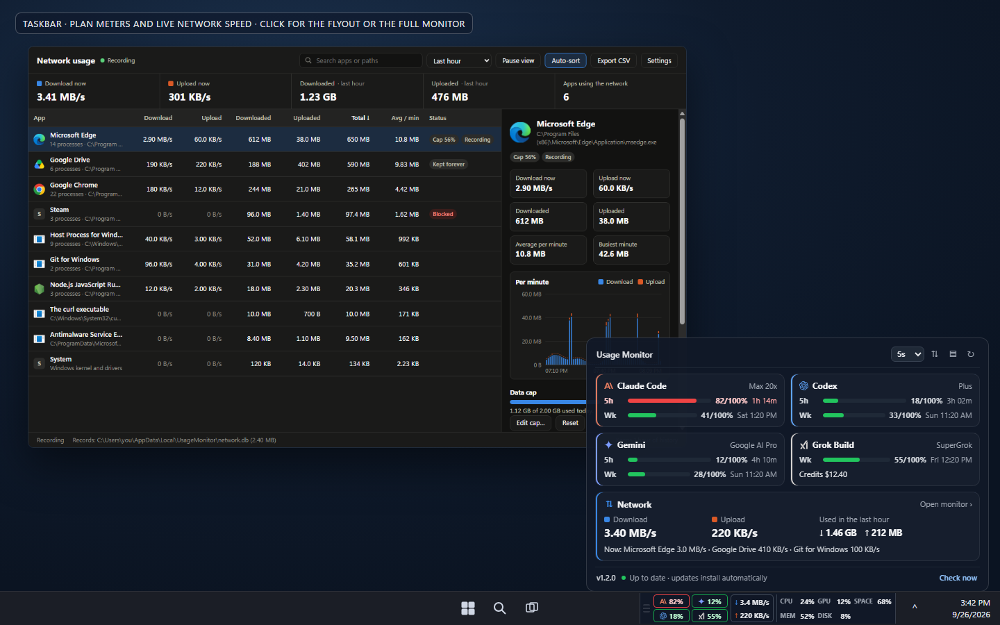
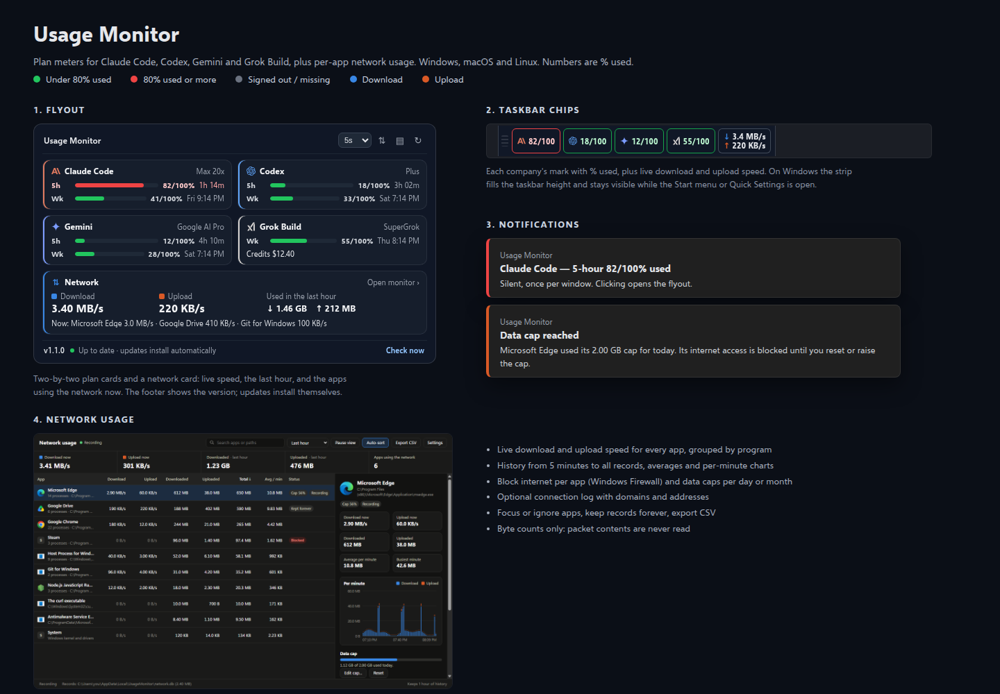
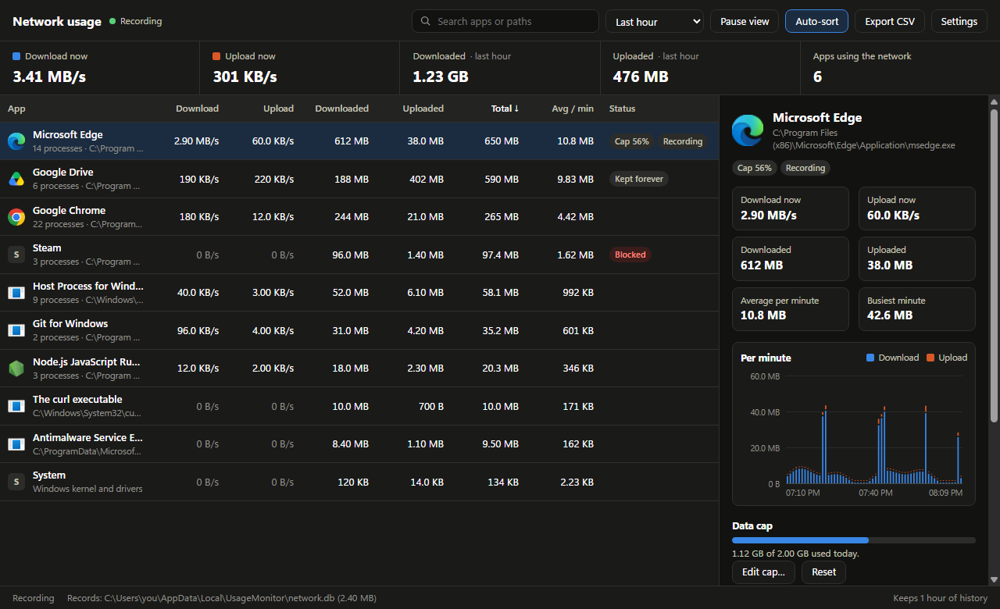

<div align="center">

# Usage Monitor

**See how much of your Claude Code, Codex, Gemini, Grok, Cursor and GitHub Copilot plan you've used — and which apps are eating your bandwidth — without leaving your taskbar.**

[](https://github.com/sb-git-cs/usage-monitor/actions/workflows/ci.yml)
[](LICENSE)

[](https://github.com/sb-git-cs/usage-monitor/stargazers)



[Quick start](#quick-start) · [Features](#what-you-see) · [Network usage](#network-usage) · [Settings](#settings) · [Android app](#android-app) · [Install](#install) · [Privacy](#privacy) · [Troubleshooting](#troubleshooting)

</div>

## Why Usage Monitor?

- **Never hit a limit by surprise.** 5-hour and weekly plan meters for **Claude Code**, **Codex**, **Gemini** and **Grok Build**, always visible as small chips on your taskbar.
- **Zero setup for the meters.** Reuses the logins your CLIs already stored. No API keys, no accounts, no extra cost.
- **Find the bandwidth hog.** Live per-app download/upload speed, per-minute history, data caps and one-click blocking (Windows).
- **Private by design.** Runs entirely on your machine. Stores byte counts only, never traffic contents.
- **Stays current on its own.** Checks for a new version at launch, when your laptop wakes and every six hours, installs it and restarts. No manual updating.
- **See it coming.** A burn-rate forecast tells you when a window will hit 100% at your current pace, before it happens.
- **On your phone too.** The Android app shows your computer's plan meters, your phone's mobile and Wi-Fi data against your data plan, and its CPU, memory and battery, with home screen widgets.
- **Cross-platform.** Windows 10/11, macOS 12+, 64-bit Linux, and Android 10+.

## Quick start

```sh
git clone https://github.com/sb-git-cs/usage-monitor.git
cd usage-monitor
npm install
npm run setup   # installs any missing CLIs (Windows), then starts the app
```

Sign in once to the tools you want metered (`claude`, `codex login`, `agy`, `grok`, and Cursor or `gh auth login` when you use those) and the chips fill in within seconds. Needs [Node.js](https://nodejs.org/) 22.13+. Prefer an installer? Download one from [**Releases**](https://github.com/sb-git-cs/usage-monitor/releases/latest) (Windows `.exe`, macOS `.dmg`, Linux `.AppImage`). Either way, [updates install automatically](#automatic-updates).

> If Usage Monitor saves you from a surprise rate limit, please ⭐ **star the repo** — it helps other developers find it.

## What you see

| Surface | What it does |
| --- | --- |
| **Flyout** | Two-by-two provider cards (5-hour / weekly, `used/total %`), plus a **Network** card with live download and upload speed, the data used in the last hour, and the apps using the network right now. Click the Network card (or the ⇅ button) to open the full Network usage window. The footer shows the version and the [automatic update](#automatic-updates) status (**Up to date**, **Downloading 1.2.0… 42%**, …) with **Check now**. It rests flush on top of the taskbar. **Open flyout** / **Hide flyout**. Click outside the panel to close it. On Windows, **Snap flyout to taskbar** / **Unsnap flyout from taskbar** parks the panel just above the taskbar. |
| **Chips** | Compact two-row strip with provider marks and percentages, stacked network speeds (click to open Network usage), and live system readings. On Windows, **Snap chips to taskbar** keeps the strip in an empty gap; if there is no room, it pops out above the taskbar. On macOS/Linux it floats and can be dragged anywhere. Click a provider to open the flyout; right-click for the menu. |
| **Network usage window** | Live download and upload speed for every app, history for the chosen time range, per-minute charts, data caps, blocking and connection logs. Open it from the tray menu (**Network usage…**) or start the app with `--network`. |
| **Tray icon** | A Usage Monitor icon in the notification area / menu bar; its tooltip shows the live network speed. **Click** it to show the chips again. **Right-click** for the menu (on Linux the menu opens on click). **Double-click** opens the flyout. |
| **Notifications** | A silent notification the first time a plan bar crosses your warning level (80% unless you change it), when a window is on course to run out before it resets, when an app reaches its network data cap, and when Usage Monitor updates itself. None are shown during quiet hours. |
| **Forecast** | Under each provider card in the flyout: when the window reaches 100% at the current pace (from the last hour of readings, or six hours for weekly windows), shown only if that is before it resets. |

The chips now stack in **two compact rows**, with short provider percentages and stacked download/upload speeds. **CPU**, **MEM**, **GPU** (when detected), **DISK** activity and **SPACE** used sit alongside them. CPU and memory refresh every 2 seconds, GPU/disk activity every 5 seconds, and storage every 30 seconds. Hover DISK or SPACE for drive details: DISK shows the busiest physical HDD/SSD on Windows; SPACE shows the fullest mounted volume. On macOS/Linux, DISK shows read/write throughput and GPU utilization depends on driver support. An unavailable reading is shown as a dash.



| Mark | Provider | Windows shown |
| --- | --- | --- |
| Anthropic | Claude Code | 5-hour and weekly |
| OpenAI | Codex | 5-hour and weekly |
| Gemini | Gemini (Antigravity CLI / Gemini CLI) | Gemini model 5-hour and weekly when the API reports them |
| xAI | Grok Build | Weekly; monthly billing fallback when reported (no 5-hour bar) |

Grok's subscription percentage is shown as **weekly**; if the API only reports monthly billing usage and a monthly limit, that fallback is labeled **Monthly**. Gemini shows only Gemini model pools from Antigravity (`agy`) or Gemini CLI, retaining model labels when the period is unspecified.

## Network usage

See exactly which apps are using your internet, live and over time.



| Feature | Details |
| --- | --- |
| Live per-app usage | Download and upload speed for every app, updated every second. |
| History and averages | Keeps the last hour by default (older records are deleted automatically). Pick a range from 5 minutes to all records; each app shows its average per minute and a per-minute chart with its busiest minute. |
| Keep forever | Mark an app to keep its records indefinitely; they are never pruned. |
| Block internet per app | One click adds or removes a Windows Firewall rule for the app (Windows). |
| Data caps | Set a limit that counts until you reset it, per day, or per month. When an app reaches it you get a notification, and on Windows its internet access is blocked. Reset, raise or remove the cap to restore access. |
| Connection recording | Optionally record the domains and IP addresses an app talks to (off by default, per app, deletable, pruned with the rest of the history). |
| Pause the view | Freeze the list so you can read and click while recording continues. |
| Grouping | Every instance of a program (for example each `chrome.exe`, or every helper inside a macOS app bundle) is combined into one row with a process count. |
| Names and icons | Apps show their friendly name and real icon. |
| Search and sort | Filter by name or path and sort by any column. **Auto-sort** keeps re-sorting as the numbers change; turn it off to keep rows in place. |
| Focus and ignore | **Only track this app** records just the apps you choose; **Ignore this app** stops recording and hides it. Both lists are in Settings. |
| Records folder | Choose any folder for the records database (`network.db`). Existing records move with it, or you can switch to a database already in that folder. |
| Runs in the background | Closing the window keeps recording from the tray; **Start with Windows** / **Open at login** / **Start at login** starts it hidden. |
| Full control of data | Delete one app's records, records older than a chosen age, or everything. |
| Export | Save the current view (filtered and sorted) as CSV. |

### How it measures, per platform

| | Windows | macOS | Linux |
| --- | --- | --- | --- |
| Source | Kernel network events (Event Tracing for Windows), read by a small helper | `nettop` (built in) | Kernel socket statistics via `ss` (iproute2) |
| Admin rights | Once, to install the helper | No | No |
| Counts | TCP and UDP, including QUIC | TCP and UDP | TCP only |
| Domains | From DNS answers seen on the PC | Optional reverse DNS | Optional reverse DNS |
| Blocking | Windows Firewall rule per program | Not available | Not available |
| Data caps | Notify and block | Notify | Notify |

**Windows helper.** The first time you open **Network usage**, click **Set up (needs administrator)** and approve the prompt. Usage Monitor compiles its helper from source (`helpers/windows/NetCapture.cs`) with the C# compiler built into Windows, installs it under `C:\Program Files\Usage Monitor Network Helper\<your account>`, and registers a scheduled task (`\UsageMonitor\NetCapture-<your account>`) that runs it as SYSTEM at sign-in and whenever Usage Monitor starts. Only administrators can change those files. The helper only talks to your own Usage Monitor over a local named pipe, and it only adds or removes block rules it created (group **Usage Monitor** in Windows Firewall). When a new version of the helper ships, the window offers **Update helper**. To remove it, open **Settings → Network helper → Remove helper**; do this before uninstalling Usage Monitor.

**Honest limits.** None of this uses a packet driver, so full HTTPS URLs and packet contents can't be seen. They stay encrypted, and connection recording shows domains and IP addresses, not URLs. Speed throttling isn't included; use blocking or data caps to control heavy apps. Caps count while Usage Monitor is running. On Linux, UDP/QUIC traffic isn't countable without root, connections that open and close within a second can be missed, and apps owned by other users appear as **Other** unless Usage Monitor runs as root. macOS only allows per-app blocking through a signed network extension, so blocking isn't offered there.

## Settings

Open **Settings…** from the right-click menu, or the ⚙ button in the flyout.

| Setting | What it does |
| --- | --- |
| Start at login, refresh interval | Same as the menu items. |
| Warn at | The percentage (50–95%) at which chips and bars turn amber and the plan notification fires. |
| Notifications | Limit warnings, forecast warnings, and quiet hours (for example 22:00 to 07:00) when nothing is shown. |
| Chips | Which providers and system readings the chips strip shows, and whether network speed is on it. |
| Updates | Install updates automatically, the **Stable** or **Beta** channel, and **Check now**. |
| Phone | Share this computer's plan meters with the Android app. **Pair a phone** shows a QR code and a code immediately. See and remove paired phones. |

## Android app

Download `UsageMonitor-<version>.apk` from [**Releases**](https://github.com/sb-git-cs/usage-monitor/releases/latest) on an Android 10+ phone and open it (Android asks once to allow installs from your browser).
Version 1.4.0 publishes desktop downloads only; build Android from source using the
[Android build instructions](android/README.md).

| Screen | What it shows |
| --- | --- |
| **Plans** | Your computer's Claude Code, Codex, Gemini, Grok Build and Cursor meters, reset times and forecasts, plus its CPU, memory, GPU, disk and network. Read over your Wi-Fi every 30 seconds while the app is open. GitHub Copilot remains available in the desktop app. |
| **Data** | Live download and upload speed; mobile and Wi-Fi data today and this billing cycle; data per app. Needs **Usage access**, which the app asks for. |
| **Phone** | CPU clock per core, memory, storage, battery level, temperature and current, heat status. |
| **Settings** | Pairing, status bar speed, data plan (billing day, monthly and daily caps, warning level), alerts and quiet hours, updates, permissions. |

- **Widgets**: *Plan meters*, *Data usage* and *Phone status*, each at **4×2**, **4×1**, **2×1** and **1×1**. Every preset can be resized in both directions. They refresh every 15 minutes in the background, every minute while the status bar speed is on, and whenever you open the app.
- **Status bar speed**: the current speed as the notification icon, updated every second, with today's data in the notification. Switch it from Settings or the **Network speed** Quick Settings tile.
- **Alerts**: plan warning, limit reached and forecast (like the desktop), and your mobile data cap at the warning level and when used up. Quiet hours apply.
- **Updates itself**: checks GitHub when opened and every six hours, verifies the download's SHA-256 and that it is signed with the same key, then installs it. Android asks you to allow installing updates once, and to confirm the first update; from Android 12 later ones install on their own.

**Pairing.** On the computer, click **Pair** on the flyout, or **Pair a phone…** in **Settings → Phone**. Sharing turns on, and a QR code and a code appear immediately. The code is good for 10 minutes for one phone, including after Settings closes; **Cancel** withdraws it. In the app, tap **Pair** and scan the QR code (or type the address and code). The phone and computer must be on the same network. The phone keeps a key derived from the code; the computer answers only signed requests from paired phones and encrypts every reply. Your CLI logins stay on the computer unless you allow a phone to read usage directly (the phone asks; you confirm here). It then receives only current access tokens, never refresh tokens, and you can stop it in **Settings → Phone**. The phone can also sign in to Claude Code, Codex, Grok Build or Cursor itself. See [`docs/phone-protocol.md`](docs/phone-protocol.md) and [`docs/phone-accounts.md`](docs/phone-accounts.md).

**Honest limits.** Android doesn't let apps read how busy the CPU is, so the app shows how fast the cores run against their top speed. Android's data counts are kept in 2-hour blocks, so "today" can include a little of the evening before. Widgets can't refresh more often than every 15 minutes on their own. Away from the computer's network the Plans screen and widget show the last reading.

**Building it.** `cd android && ./gradlew assembleDebug` (JDK 17 and the Android SDK). Release APKs are built and signed by the Release workflow; see [`android/README.md`](android/README.md) for the signing key.

## Requirements

- Windows 10/11, macOS 12 or newer, or a 64-bit Linux desktop with `ss` (iproute2; installed by default on most distributions)
- [Node.js](https://nodejs.org/) 22.13 or newer (source installs/builds only)
- For the plan meters, signed in to the tools you want metered:
  - [Claude Code](https://code.claude.com/) (`claude`)
  - [Codex](https://github.com/openai/codex) (`codex`)
  - [Antigravity CLI](https://antigravity.google/) (`agy`) or [Gemini CLI](https://github.com/google-gemini/gemini-cli) (`gemini`)
  - [Grok Build](https://grok.com/) (`grok`)
  - [Cursor](https://cursor.com/) (signed in in the app, or `cursor-agent login`)
  - [GitHub Copilot](https://github.com/features/copilot) (signed in to GitHub in the editor, or `gh auth login`)

You do not need every tool. A missing login shows as gray with a sign-in hint. Cursor and Copilot stay off the strip until that app or login is on this computer; a signed-in Free plan is shown with the allowance it includes. Settings shows the account each meter is reading, and **Switch account** opens the provider's sign-in page in your browser. Meters read the tool's saved local login, so also sign in through that tool to change the metered account; Settings shows the command. Choosing a saved Grok account changes the meter immediately. On macOS, Claude Code keeps its login in the Keychain; Usage Monitor reads it there (macOS may ask once to allow access) and never rewrites it.

## Install

### Packaged app

Download the installer for your platform from [**Releases**](https://github.com/sb-git-cs/usage-monitor/releases/latest), or build it yourself. Build outputs land in `dist/`:

| Platform | Command | Files |
| --- | --- | --- |
| Windows | `npm run dist` | `UsageMonitor-Setup-1.3.0.exe` (installer; updates itself), `UsageMonitor-portable-1.3.0.exe` (single-file portable), `Usage Monitor-1.3.0-win.zip` (unpacked folder) |
| macOS | `npm run dist:mac` (on a Mac) | `UsageMonitor-1.3.0-<arch>.dmg`, `.zip` |
| Linux | `npm run dist:linux` (on Linux) | `UsageMonitor-1.3.0-x86_64.AppImage` (updates itself), `.tar.gz` |

```sh
npm install
npm run dist        # or dist:mac / dist:linux
```

Builds are unsigned. On macOS, open the app with right-click → **Open** the first time.

To publish a release, bump `version` in `package.json`, add a section to [`CHANGELOG.md`](CHANGELOG.md) and commit, then either push a matching tag (`git tag v1.1.1 && git push origin v1.1.1`) or open **Actions → Release → Run workflow** and tick **publish**. The workflow tests, builds all three platforms, creates the tag if needed and attaches the installers plus the update metadata (`latest.yml`, `latest-linux.yml`, `latest-mac.yml`, `*.blockmap`) to a GitHub release. Installed copies pick the release up on their next check.

Sign in to the tools once (`claude`, `codex login`, `agy`, `grok`, and Cursor or `gh auth login` when you use those) so the meters can read usage. A packaged copy still uses those same local logins; it does not replace the tools.

### From source

```sh
git clone https://github.com/sb-git-cs/usage-monitor.git
cd usage-monitor
npm install
npm run setup
```

On Windows, `npm run setup` runs `scripts/install.ps1`, which:

1. Installs **Claude Code**, **Codex**, **Antigravity** (`agy`, Gemini), and **Grok Build** using each product’s official Windows installer
2. Skips any CLI already on your PATH
3. Starts Usage Monitor (`npm start`)

You can also double-click `scripts\install.cmd` or run `.\scripts\install.ps1` from the repo root. On macOS and Linux, `npm run setup` installs dependencies, lists where to get each CLI, and starts the app.

Sign in once per tool so the meters can read usage (a missing login shows as a gray chip):

```sh
claude
codex login
agy
grok
cursor-agent login
gh auth login
```

Usage Monitor only:

```sh
npm start
```

`npm start` **detaches** from the terminal: you can close the console and the app keeps running. Quit only from the right-click **Quit** menu. Use `npm run start:fg` if you want logs in the terminal (that process *will* die if you close the console).

The first launch:

- Shows the compact **chips** widget (snapped onto the Windows taskbar in an empty gap; floating on macOS and Linux)
- Registers **Start with Windows** / **Open at login** / **Start at login**. Uncheck it in the right-click menu to turn that off.
- Starts recording network usage (on Windows, once the helper is set up)

## Start at login

- **Windows:** a hidden **`Usage Monitor.vbs`** in the Startup folder runs Electron with no console. The network helper starts on its own through its scheduled task.
- **macOS:** a login item (packaged app only; a source checkout isn't registered).
- **Linux:** `~/.config/autostart/usage-monitor.desktop` (uses the AppImage path when packaged).

To disable, right-click the flyout, chips or tray icon and uncheck the login option.

## Automatic updates

With **Install updates automatically** on (the default), Usage Monitor checks GitHub about 8 seconds after it starts, 30 seconds after the computer wakes or is unlocked (at most every 30 minutes), and every six hours while it runs. If it is offline it retries after 1, 5 and 15 minutes. When there is a new version it installs it and restarts by itself, with a notification; it waits while you are working in the Network usage window or a menu.

| How you installed it | What happens |
| --- | --- |
| `git clone` + `npm start` | Fetches GitHub and fast-forwards your branch (its upstream, or `origin/main`). If `package.json` or `package-lock.json` changed, `scripts/post-update.js` runs `npm ci` after the app has quit, then starts it again. Needs `git` and `node` on PATH. Skipped (and shown in the flyout) when you have uncommitted changes, local commits that are not on GitHub, or a detached checkout. |
| Windows installer (`UsageMonitor-Setup-*.exe`) | Downloads the new installer from the GitHub release (only the changed blocks when it can), checks its SHA-512, installs silently into the same folder and restarts. No administrator prompt. |
| Linux AppImage | Downloads the new AppImage, replaces the old one and restarts. **Start at login** follows the new file. |
| Portable `.exe`, `.zip`, `.tar.gz`, macOS `.dmg` | These can't replace themselves (macOS only allows in-place updates for signed apps), so you get one notification per new version; click it, or **Download** in the flyout, to get the file for your system. |

**Check for updates now** (right-click menu, or **Check now** in the flyout footer) runs a check at any time, also when automatic updates are off. Activity is written to `logs/main.log` (and `logs/update.log` for dependency reinstalls) in the local data folder listed under [Privacy](#privacy). Copies older than 1.1.0 need one manual update to get this.

## Use

- **Left-click** chips → flyout. Click anywhere outside the flyout to close it (unless the flyout is snapped to the taskbar).
- **Tray icon** → show chips if they vanished. Right-click that icon for the menu. Double-click for the flyout.
- **Right-click** flyout, chips, or the tray icon → menu
  - **Network usage…** — open the network window
  - **Settings…** — see [Settings](#settings)
  - **Show chips** — bring the meters back if they went invisible
  - Hide / show chips
  - **Show network speed on chips** (on by default)
  - Refresh now
  - **Refresh every** — 5, 15, 30, or 60 seconds (default **5s**)
  - **Open flyout** / **Hide flyout**
  - **Start with Windows** / **Open at login** / **Start at login** (on by default after first launch)
  - **Install updates automatically** (on by default); see [Automatic updates](#automatic-updates)
  - **Check for updates now**, followed by the current version and update status
  - Windows only: **Snap flyout to taskbar** / **Unsnap flyout from taskbar**, **Snap chips to taskbar** / **Unsnap chips from taskbar**
  - Quit
- Drag flyout or chips **from the title bar / dotted grip** to move them anywhere. Positions are saved.
- Click a provider card to open that product’s official usage page (Claude, Codex, [Antigravity](https://antigravity.google), Grok)
- In **Network usage**: click an app for its chart, cap, block and record controls; right-click for the full menu; **Ctrl+F** / **Cmd+F** jumps to search; arrow keys move between apps.

Meters show **used/total %** (for example `82/100%`), not remaining. A full 5-hour window reads `100/100%` in red.

Chips show the current short window: 5-hour usage first, then daily usage when available. If neither is reported, they show another available quota such as weekly. Hover over a chip to see which window it shows. Warnings begin at 80%, or the level you choose in [Settings](#settings). Cached readings are marked stale (dashed chip borders); after a reported reset time passes, usage becomes unknown until the provider confirms the new reading. The app never assumes a reset means zero usage or invents the next reset date.

## Development checks

```sh
npm ci
npm test                      # unit tests, including network parsers, store, engine and helper protocol
npm run test:ui               # real Electron windows offscreen, including the network window
node scripts/probe-capture.js # macOS/Linux: live capture of a curl download
npm run screenshots           # regenerate docs/screenshots from the real UI with demo data
npm audit --audit-level=high
npm run dist
cd android && ./gradlew testDebugUnitTest lintDebug assembleDebug   # Android app (JDK 17, Android SDK)
```

The screenshots in `docs/screenshots` are produced by `npm run screenshots`, which renders the real flyout, chips and network window offscreen with demo data (no real logins, usage or paths). The tests use synthetic credentials, responses and network samples. The UI smoke test uses hidden offscreen Electron windows and saves images under `.qa/`; it does not enable autostart or read your CLI logins. CI runs on Windows, macOS and Linux: unit and UI tests everywhere, the live capture probe on macOS and Linux, a compile and self-test of the Windows helper with Windows PowerShell 5.1, and an unpacked build per platform. See [`docs/review.md`](docs/review.md) for the defect list and [`docs/handoff.md`](docs/handoff.md) for release verification and remaining acceptance checks.

## Privacy

- Runs only on your computer; nothing about network usage leaves it
- The network monitor stores byte counts per app per minute, and domains/addresses only for apps where you turn on connection recording. It never reads packet contents
- Reverse DNS for recorded addresses is off by default; when on, lookups go to your DNS server
- Reads the credentials the tools already wrote (`~/.claude`, `.codex`, `.gemini`, `.grok`; Cursor's `auth.json` and the `cursorAuth/cachedEmail` entry in its editor database; GitHub CLI `hosts.yml` or, on Windows, the Credential Manager entry `git:https://github.com`; on Windows also the Credential Manager entry `gemini:antigravity`; on macOS the Keychain item `Claude Code-credentials`). Those reads are read-only.
- Polls each provider’s usage endpoint; never sends prompts, files, or chat history
- Phone sharing is off until you turn it on or click **Pair a phone**. When on, the computer listens on your local network (port 47329) and answers only phones paired with a code shown on its screen, with encrypted plan meters and system readings. Remove a phone in **Settings → Phone**
- The Android app reads your phone's data counts with Usage access and keeps them on the phone. It only contacts your paired computer and GitHub (for updates)
- Update checks only contact GitHub: `git fetch` for a clone, the release feed and files for an installed copy, and the public releases API for portable/zip/macOS copies. No personal data is sent
- Settings, logs (`logs/main.log`) and caches stay under `%APPDATA%\UsageMonitor` and `%LOCALAPPDATA%\UsageMonitor` (Windows), `~/Library/Application Support/UsageMonitor` (macOS), or `~/.config/UsageMonitor` and `~/.local/share/UsageMonitor` (Linux). Network records are in `network.db` there unless you choose another folder

## Troubleshooting

| Symptom | What to try |
| --- | --- |
| Gray company mark | Open that tool once and sign in (`claude`, `codex login`, `agy`, `grok`, `cursor-agent login`, `gh auth login`). If a coding CLI is missing, run `npm run setup`. |
| No chips on the taskbar | Right-click flyout → **Show chips on taskbar**. They sit in an empty gap, not over the clock. |
| Chips jump or leave a gap on the taskbar | Right-click → **Snap chips to taskbar**, then drag the dotted grip to the gap you want. They stay there instead of re-snapping on every refresh. |
| Chips vanish while the app is still running | The strip should show **loading…** and recover on its own. If they still go missing, click the Usage Monitor tray icon, or right-click → **Show chips**. |
| Flyout missing | Right-click chips → **Open flyout**. Click outside the flyout to close it. |
| Claude stuck / stale | The usage API rate-limits aggressive polling. The app backs off and keeps the last good numbers |
| Network usage says **Setup needed** (Windows) | Click **Set up (needs administrator)** and approve the prompt. If you decline, nothing is installed. |
| **Helper not running** (Windows) | Click **Start helper**. If that fails, **Settings → Reinstall helper**. Details are in `helper.log` in the helper folder. |
| Block has no effect (Windows) | Windows Firewall must be on for the current network; the window warns when it is off. |
| An app is missing on Linux | UDP-only and very short-lived connections can't be counted without root; see **Settings → What this can and can't see**. |
| Does not start at login | Leave the login option checked; on Windows confirm `Usage Monitor.vbs` exists in the Startup folder. |
| Update didn't install | The flyout footer says why (for example uncommitted changes in a clone, or offline). Use **Check for updates now** for the full message, and see `logs/main.log`. A clone needs `git` (and `node` when dependencies change) on PATH; the portable, zip, tar.gz and macOS builds only notify, see [Automatic updates](#automatic-updates). |
| Something else went wrong | Errors are logged to `logs/main.log` in the local data folder (`%LOCALAPPDATA%\UsageMonitor`, `~/Library/Application Support/UsageMonitor` or `~/.local/share/UsageMonitor`). |
| Extra Electron window / dies with the terminal | Use a packaged build or `npm start` (detached). Quit only from the right-click **Quit** menu. |
| Quit | Right-click chips or flyout → **Quit**. Hiding the flyout or closing the network window only hides them. |

## Contributing

Bug reports, feature ideas and pull requests are welcome. Open an [issue](https://github.com/sb-git-cs/usage-monitor/issues) describing what you saw (OS, which CLI, and what the chip showed), or send a PR. See [CONTRIBUTING.md](CONTRIBUTING.md) for setup, tests and the project layout. Report security issues privately as described in [SECURITY.md](SECURITY.md).

## License

[MIT](LICENSE)
